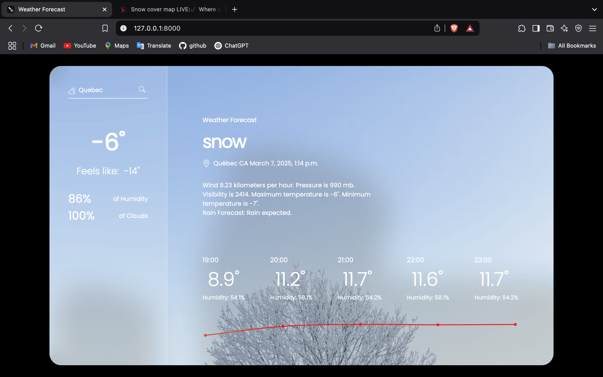
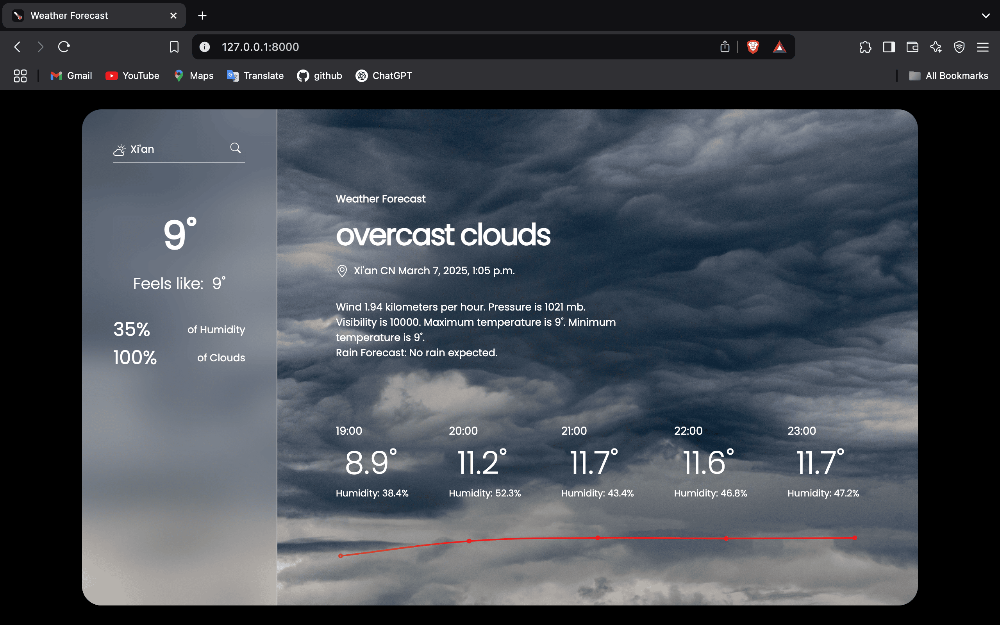

# WeatherAi

## Overview
This project is a Django-based AI system that fetches real-time weather data and predicts future temperature and humidity levels based on historical data. It utilizes OpenWeatherMap API for live weather updates and machine learning models for forecasting.

## User Interface & Output


---


---


---


## Features
- **Real-time Weather Data:** Fetches current weather conditions such as temperature, humidity, pressure, wind speed, and visibility.
- **Weather Forecasting:** Uses machine learning models (Random Forest) to predict future temperature and humidity.
- **Rain Prediction:** A classification model predicts whether it will rain tomorrow based on historical weather data.
- **Error Handling:** Gracefully handles invalid city names and API request failures.
- **Historical Data Processing:** Cleans and processes past weather data for training machine learning models.

## Tech Stack
- **Backend:** Django
- **Machine Learning:** Scikit-learn (Random Forest Classifier & Regressor)
- **Data Processing:** Pandas, NumPy
- **API Integration:** OpenWeatherMap API

## Model Performance & Mean Error
The Mean Squared Error (MSE) for the rain prediction model is **0.1506849315068493**. 
This indicates that the model's predictions are close to actual values, with lower MSE values meaning better accuracy.


## Installation
### Prerequisites
Ensure you have Python installed. You can check your Python version with:
```sh
python --version
```

### Clone the Repository
```sh
git clone https://github.com/bla999ckt/weatherAi.git
cd weatherAi
```

### Set Up API Key
Obtain an API key from [OpenWeatherMap](https://openweathermap.org/api) and update the `API_KEY` in `views.py`:
```python
API_KEY = 'your_api_key_here'
```

### Run Migrations
```sh
python manage.py migrate
```

### Start the Server
```sh
python manage.py runserver
```
Then open [http://127.0.0.1:8000/](http://127.0.0.1:8000/) in your browser.

## Usage
1. Enter a city name in the search bar.
2. Get real-time weather details.
3. View future temperature and humidity predictions.

## Error Handling
- If the user enters an invalid city, an error message is displayed instead of breaking the application.
- API request failures are handled to prevent crashes.
- Missing or incorrect data in historical records is cleaned before model training.


## File Structure
```
weatherAi/                   # Root directory of the project  
│── LICENSE                  # License information  
│── README.md                # Project documentation  
│── WeatherAi.ipynb          # Jupyter Notebook (for analysis or testing)  
│── db.sqlite3               # SQLite database file  
│── weather.csv              # Dataset file for weather-related data  
│── manage.py                # Django management script  
│  
├── forecast/                # Main Django app  
│   ├── __init__.py          # Marks the directory as a Python module  
│   ├── admin.py             # Admin panel configuration  
│   ├── apps.py              # App configuration  
│   ├── models.py            # Database models  
│   ├── tests.py             # Test cases for the app  
│   ├── urls.py              # URL routing for the app  
│   ├── views.py             # Handles logic and API calls  
│   │  
│   ├── migrations/          # Database migration files  
│   │   ├── __init__.py  
│   │   └── __pycache__/     # Compiled migration files  
│   │  
│   ├── templates/           # HTML templates for rendering views  
│   │   └── weather.html     # Main weather display page  
│   │  
│   ├── static/              # Static assets (CSS, JS, Images)  
│   │   ├── css/  
│   │   │   └── styles.css   # Stylesheet for the frontend  
│   │   ├── js/  
│   │   │   └── chartSetup.js # JavaScript for charts  
│   │   ├── img/             # Weather-related images  
│   │   │   ├── blizzard.jpeg  
│   │   │   ├── clear.jpeg  
│   │   │   ├── cloudy.jpeg  
│   │   │   ├── drizzle.jpeg  
│   │   │   ├── fog.jpeg  
│   │   │   ├── ice.jpeg  
│   │   │   ├── main-blur.png  
│   │   │   ├── mist.jpeg  
│   │   │   ├── overcast.jpeg  
│   │   │   ├── rain.jpeg  
│   │   │   ├── shower.jpeg  
│   │   │   ├── showers.jpeg  
│   │   │   ├── side-blur.png  
│   │   │   ├── site-pic.ico  
│   │   │   ├── sleet.jpeg  
│   │   │   ├── snow.jpeg  
│   │   │   ├── sunny.jpeg  
│   │   │   └── thunder.jpeg  
│  
└── weatherAi/               # Django project configuration folder  
    ├── __init__.py          # Marks it as a Python package  
    ├── asgi.py              # ASGI config for async capabilities  
    ├── settings.py          # Django project settings  
    ├── urls.py              # Root URL configuration  
    ├── wsgi.py              # WSGI config for deployment  
    └── __pycache__/         # Compiled Python files for performance  
          # Project Documentation
```

## Contributing
1. Fork the repository.
2. Create a feature branch (`git checkout -b feature-name`).
3. Commit your changes (`git commit -m 'Add new feature'`).
4. Push to the branch (`git push origin feature-name`).
5. Create a Pull Request.

## License
This project is licensed under the MIT License.
